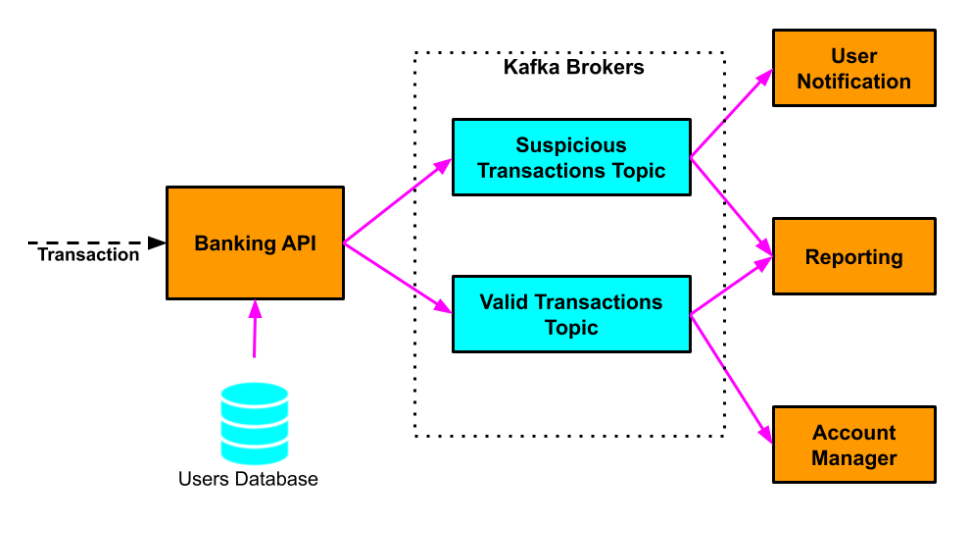

# Project Title

Simple Banking Operations with Kafka Message Broker.

## Description
Distributed App Incluing BankingApi which Takes information to perform a transaction between two accounts after validating with simple redis database has entries each entry is {name , balance , location}. the idea is simply to validate the operation by checking 
location and based on the result which is eiher : Valid or Suspicious and we write the event to kafka topic in the name of the results.
so BankingAPI acts as producer to kafka topics , and the consumers are UserNotification and Reporting and AccountManager.
Valid is consumed by : Reporting and AccountManager.
Suspicious is consumed by : Reporting and UserNotification.

## Getting Started
* Modify IPs and Ports to suit your use case and Machines.
* first: run redis database on port 6379
* second: run services 

## Authors

Contributors names and contact info

* Name: Mohammed Salameh
* email : mohammedsalameh37693@gmail.com
* LinkedIn : www.linkedin.com/in/mohammed-salameh-8b4811313
